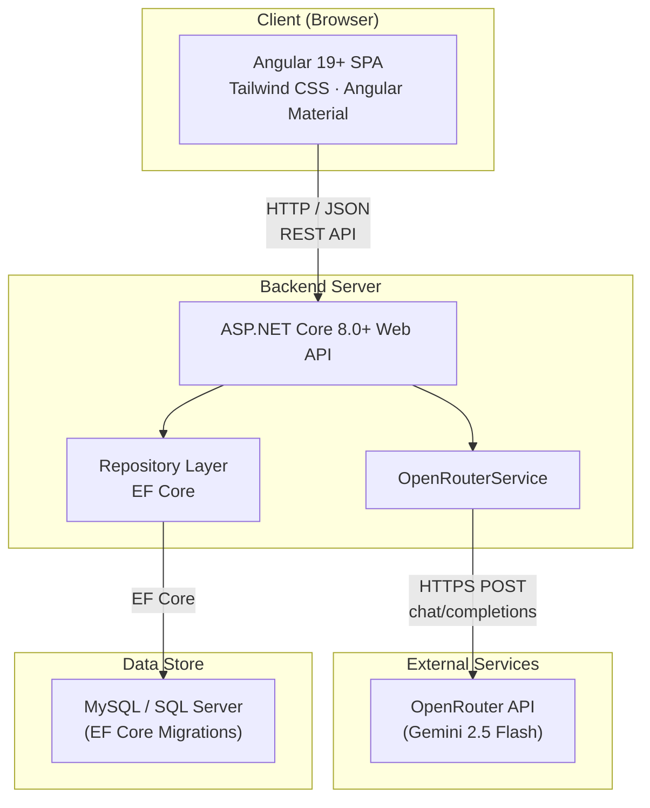
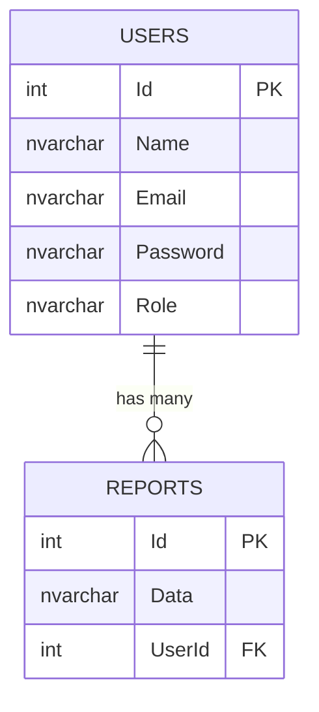
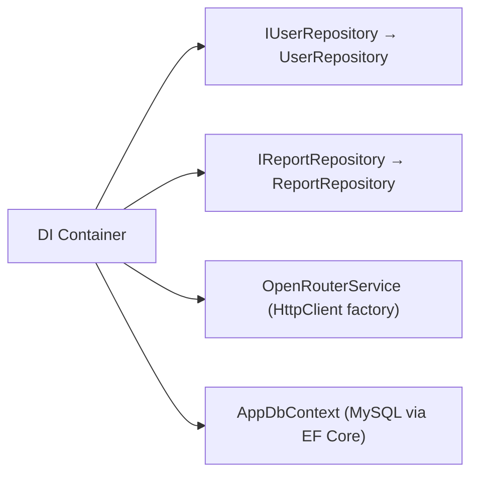
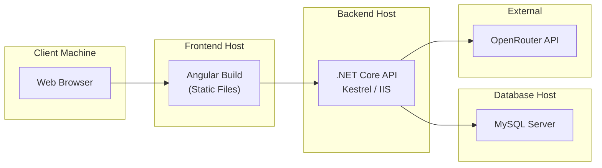

# Architecture Overview — AI Behavioral Personality Profiler

## 1. Introduction

The **AI Behavioral Personality Profiler** is a full-stack web application that conducts interactive, scenario-based interviews with users and produces AI-generated personality profiles. It combines a modern Angular single-page application with an ASP.NET Core REST API and an external AI inference provider (OpenRouter / Google Gemini 2.5 Flash).

---

## 2. High-Level Architecture



---

## 3. Technology Stack

| Layer | Technology | Version | Purpose |
| :--- | :--- | :--- | :--- |
| **Frontend Framework** | Angular | 19+ | SPA framework with standalone components |
| **Frontend Styling** | Tailwind CSS | 4.x | Utility-first responsive styling |
| **Frontend UI** | Angular Material | 19.x | Material Design component library |
| **Backend Runtime** | ASP.NET Core | 8.0+ / .NET 9 | REST API framework |
| **ORM** | Entity Framework Core | 9.x | Code-first database access with migrations |
| **Database** | MySQL (dev) | 8.x | Relational data store |
| **AI Provider** | OpenRouter → Gemini 2.5 Flash | — | Scenario question generation & personality analysis |
| **Build & Package** | npm / dotnet CLI | — | Project tooling |

---

## 4. Component Breakdown

### 4.1 Frontend — Angular SPA

The frontend follows a **presentation-model** layered architecture:

```
frontend/src/app/
├── admin/                  # Admin-only module (guarded)
│   ├── admin-homepage/     # Admin dashboard
│   ├── adminlogin/         # Admin login + adminloginService
│   ├── report/             # Per-user report viewer
│   └── admin.guard.ts      # Route guard (localStorage check)
├── model/
│   └── userModel.ts        # Shared UserModel type
├── presentation/           # User-facing feature modules
│   ├── home/               # Dashboard / landing (post-login)
│   │   └── warningpage/    # Warning sub-component
│   ├── settings/           # Profile & personality report display
│   │   ├── settings.ts     # Component logic (chart rendering, report parsing)
│   │   └── settings-service.ts  # HTTP calls to /api/user & /api/report
│   ├── sign-up/            # Registration & login form
│   ├── splash/             # Landing / splash screen (route: /)
│   └── test-page/          # Interactive AI chat test
│       ├── test-page.ts    # Chat flow, progress bar, 15-question loop
│       └── test-service.ts # HTTP calls to POST /api/ai/chat
├── assests/
│   └── logo.ts             # Base64-encoded logo constant
├── app.routes.ts           # Route definitions
├── app.config.ts           # Angular app config (providers)
└── app.ts                  # Root AppComponent
```

**Key Design Decisions:**
- **Standalone Components** — no `NgModules`; every component is self-contained.
- **localStorage Auth** — user session stored as `loginStatus`, `id`, and `isAdminLoggedIn` in `localStorage`.
- **Admin Guard** — functional route guard (`adminGuard`) checks `adminloginService.isLoggedIn()` before allowing access to admin routes.

### 4.2 Backend — ASP.NET Core API

The backend uses a **Controller → Repository** pattern with a dedicated AI **Service** layer:

```
backend/AIProfilerAPI/
├── Controllers/
│   ├── AiController.cs       # POST /api/ai/chat — orchestrates Q&A + analysis
│   ├── userController.cs     # /api/user — register, login, CRUD
│   └── ReportController.cs   # /api/report — get reports by ID or userId
├── Models/
│   ├── AppDbContext.cs        # EF Core DbContext (Users, Reports)
│   ├── user.cs                # User entity (Id, Name, Email, Password, Role)
│   └── report.cs              # Report entity (Id, Data, UserId)
├── Repositories/
│   ├── IUserRepository.cs     # User repository interface
│   ├── UserRepository.cs      # EF Core implementation
│   ├── IReportRepository.cs   # Report repository interface
│   └── ReportRepository.cs    # EF Core implementation (upsert logic)
├── service/
│   └── OpenRouterService.cs   # AI inference via OpenRouter REST API
├── Constants/
│   └── PromptTemplates.cs     # System prompts for Q generation & analysis
├── Migrations/                # EF Core migration history
├── Program.cs                 # App entry point, DI, CORS, middleware
└── appsettings.json           # Connection strings, API keys
```

**Key Design Decisions:**
- **In-Memory Session State** — `AIController` uses `static Dictionary<string, List<string>>` to track per-user Q&A sessions (non-persistent across restarts).
- **Upsert Reports** — `ReportRepository.AddReport()` replaces any existing report for the same user (one active report per user).
- **API Key Fallback** — `OpenRouterService` tries a primary API key first, then falls back to a secondary key on HTTP 429 rate-limit responses.
- **CORS** — restricted to `http://localhost:4200` (Angular dev server).

### 4.3 Database

Two core tables managed via EF Core code-first migrations:



- **Users** — stores credentials (plain text in dev) and role (`User` / `Admin`).
- **Reports** — stores the full Markdown personality analysis per user. The `AddReport()` method upserts so each user has at most one current report.

### 4.4 External AI Service

| Property | Value |
| :--- | :--- |
| **Provider** | OpenRouter |
| **Model** | `google/gemini-2.5-flash` |
| **Max Tokens** | 2000 |
| **Endpoint** | `https://openrouter.ai/api/v1/chat/completions` |
| **Rate-Limit Strategy** | Dual API key rotation with 2 s delay on 429 |

**Two prompt modes** are defined in `PromptTemplates.cs`:

1. **Scenario Question Generation** — produces one creative, non-repetitive behavioral scenario question per call.
2. **Personality Analysis** — takes all 15 Q&A pairs and produces a structured personality profile with:
   - Core Traits, Behavioral Patterns, Strengths & Blind Spots
   - 9 numeric personality scores (0–100) enclosed in `SCORES_START` / `SCORES_END` markers

---

## 5. Routing Map

### Frontend Routes

| Path | Component | Auth Required | Guard |
| :--- | :--- | :--- | :--- |
| `/` | `Splash` | No | — |
| `/home` | `Home` | No (checks `loginStatus` internally) | — |
| `/signup` | `SignUp` | No | — |
| `/home/testpage` | `TestPage` | Yes (redirects if not logged in) | — |
| `/home/settings` | `Settings` | No | — |
| `/admin/adminlogin` | `Adminlogin` | No | — |
| `/admin` | → `/admin/admin-homepage` | Yes | `adminGuard` |
| `/admin/admin-homepage` | `AdminHomepage` | Yes | `adminGuard` |
| `/admin/report/:id/:email` | `Report` | Yes | `adminGuard` |

### Backend API Routes

| Route Prefix | Controller | Description |
| :--- | :--- | :--- |
| `/api/user` | `UserController` | User CRUD + auth |
| `/api/ai` | `AIController` | Chat-based Q&A + personality analysis |
| `/api/report` | `ReportController` | Report retrieval |

---

## 6. Dependency Injection (Program.cs)



All dependencies are registered as **Scoped** services (per-request lifetime) except `OpenRouterService` which uses `AddHttpClient<T>()` for managed `HttpClient` instances.

---

## 7. Deployment Topology



| Component | Hosting Options |
| :--- | :--- |
| **Frontend** | Vercel, Netlify, Azure Static Web Apps, nginx (static files) |
| **Backend** | Azure App Service, AWS EC2 / ECS, Docker container, IIS |
| **Database** | Azure Database for MySQL, AWS RDS, local MySQL 8.x |

### Local Development

```bash
# Start backend (port 5233)
cd backend/AIProfilerAPI
dotnet run

# Start frontend (port 4200)
cd frontend
ng serve
```

Or use the provided `start_project.bat` to launch both simultaneously.
