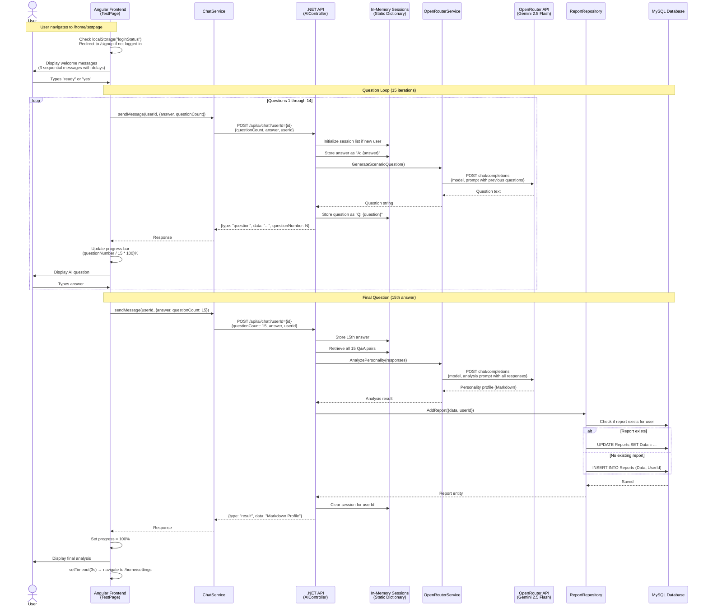
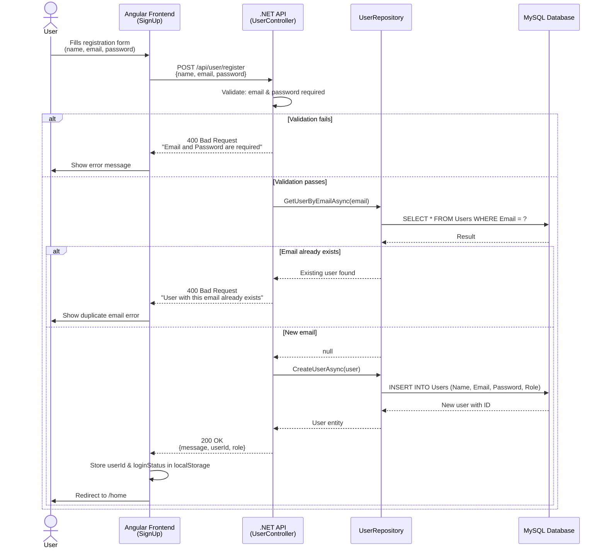
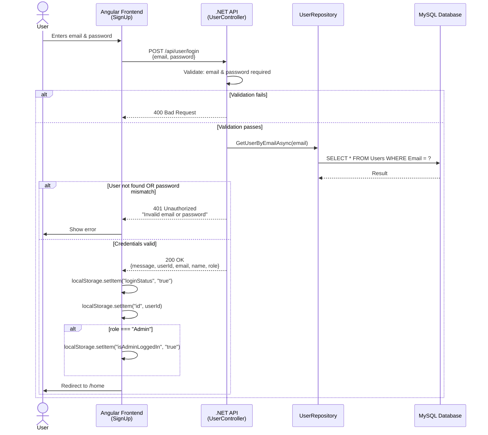
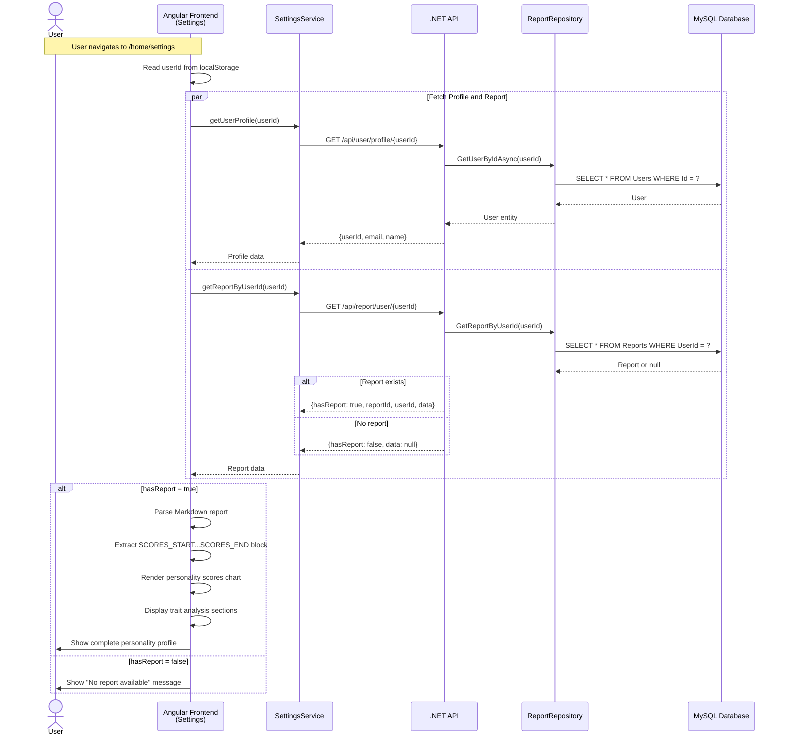
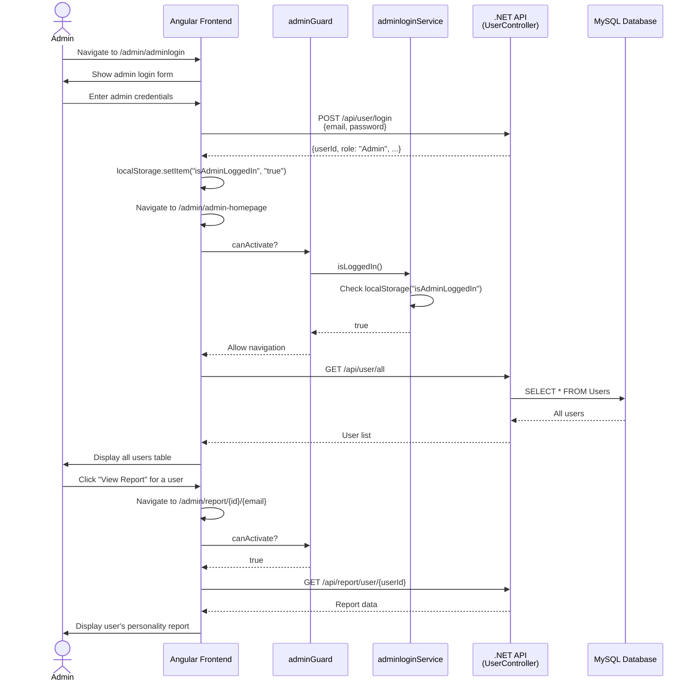
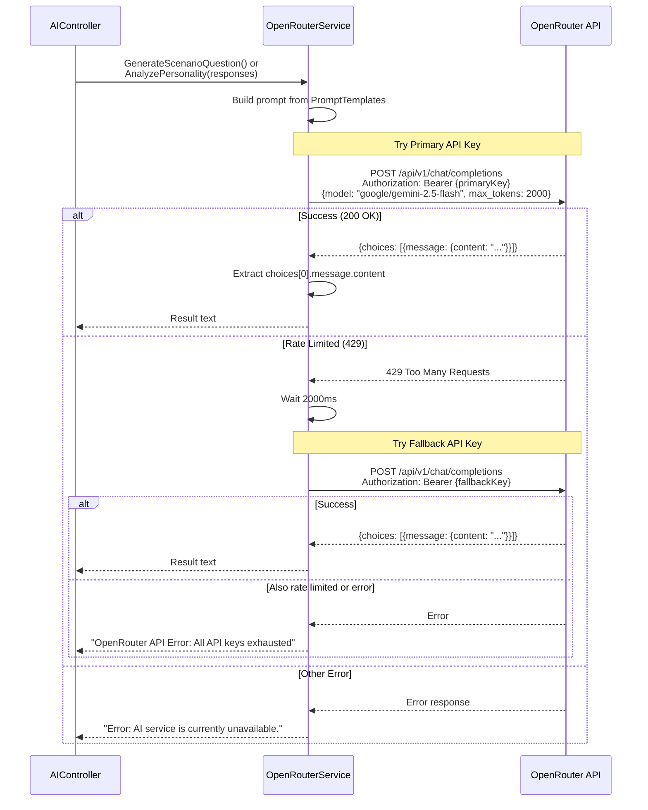
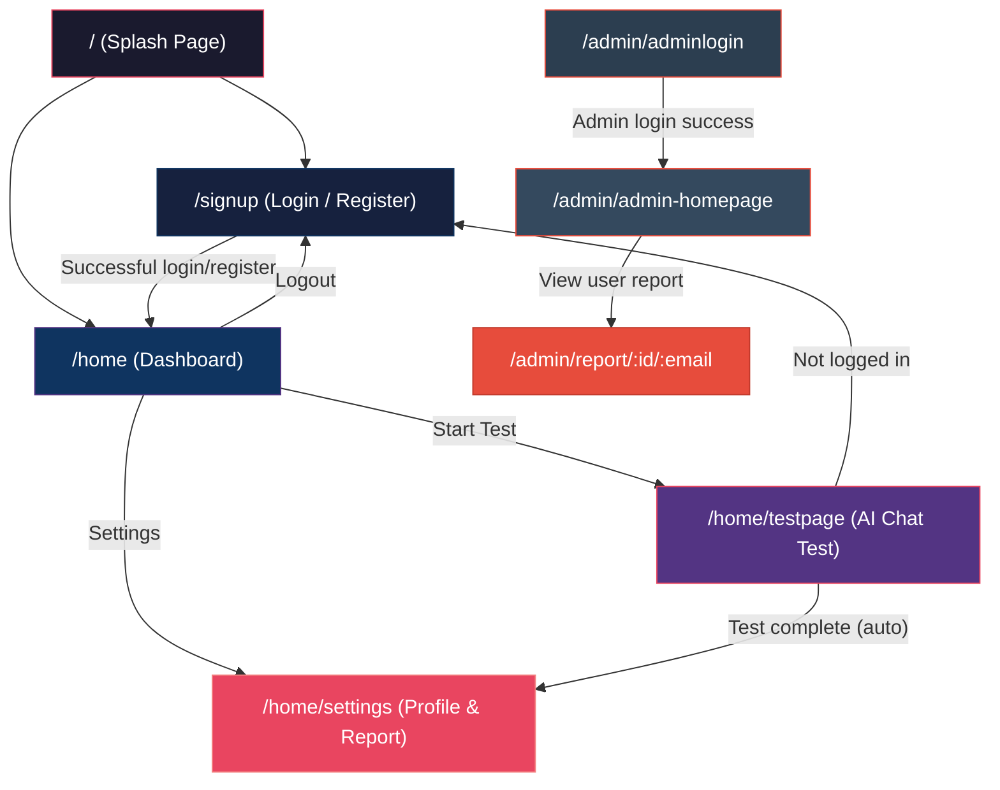
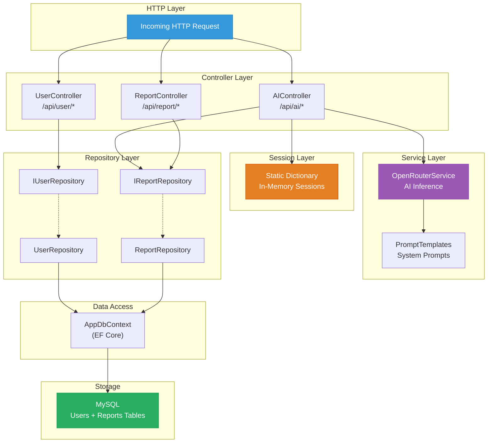
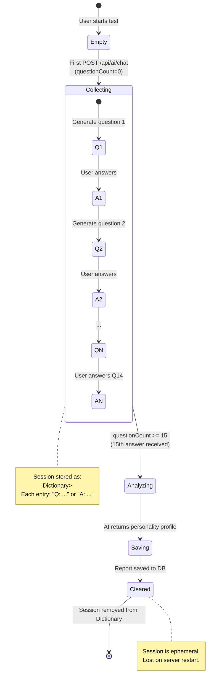

# Data Flow & Sequence Diagrams — AI Behavioral Personality Profiler

This document contains Mermaid diagrams for every major user flow and inter-service communication pattern in the system.

---

## Table of Contents

- [1. Personality Test Flow (End-to-End)](#1-personality-test-flow-end-to-end)
- [2. User Registration Flow](#2-user-registration-flow)
- [3. User Login Flow](#3-user-login-flow)
- [4. Report Retrieval Flow](#4-report-retrieval-flow)
- [5. Admin Dashboard Flow](#5-admin-dashboard-flow)
- [6. AI Service Call (OpenRouter)](#6-ai-service-call-openrouter)
- [7. Full Application Navigation](#7-full-application-navigation)
- [8. Data Layer Flow](#8-data-layer-flow)

---

## 1. Personality Test Flow (End-to-End)

The core feature: a 15-question conversational loop that generates a personality profile.

---

## 2. User Registration Flow

---

## 3. User Login Flow

---

## 4. Report Retrieval Flow

---

## 5. Admin Dashboard Flow

---

## 6. AI Service Call (OpenRouter)

Detail of the `OpenRouterService` internal logic including API key fallback:

---

## 7. Full Application Navigation

Overview of all possible user navigation paths:

---

## 8. Data Layer Flow

How data flows through the backend layers:

---

## 9. Session State Lifecycle

The in-memory session managed by `AIController`:

