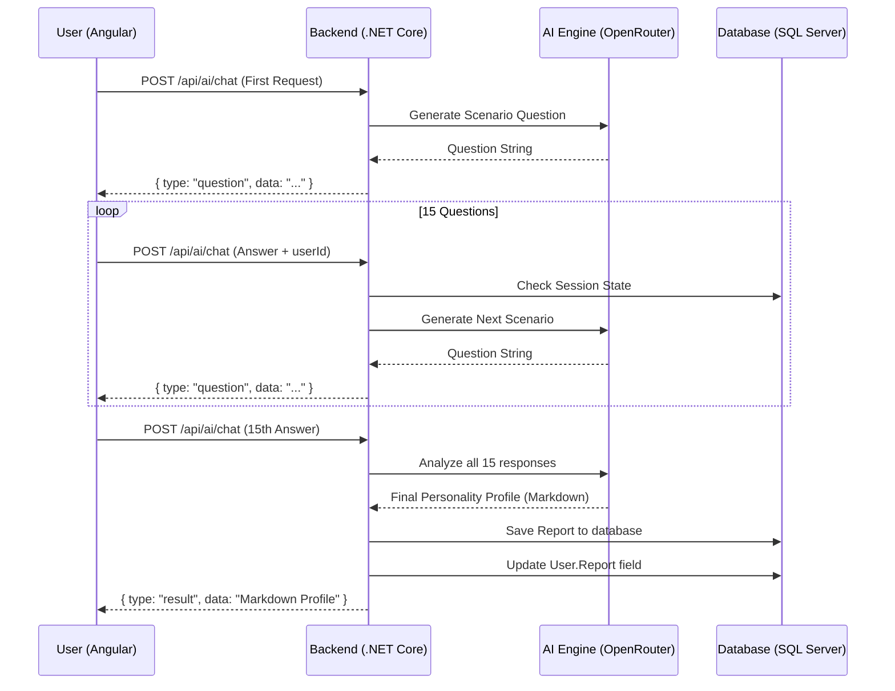
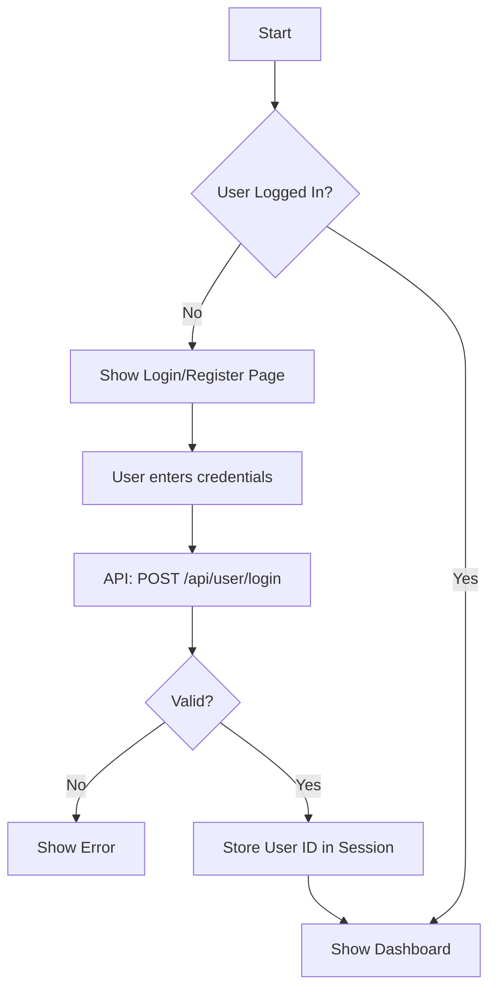

# Flow Diagrams - AI Behavioral Personality Profiler

## 1. User Profiling Sequence
This diagram illustrates the process of a user answering scenario-based questions to generate a personality profile.

## 2. Authentication Flow

